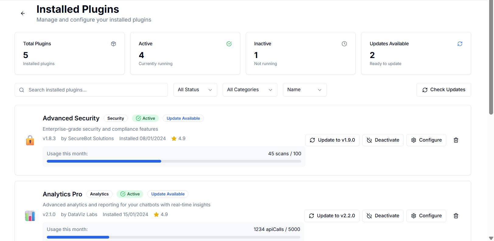

# Pages or User Interfaces and Their Core Functionalities

## Create Chatbot Interface

Allows users to create and deploy chatbots using their own data with a live preview/test of the chatbots. Users can import data for training the chatbot through:

* Links
* Direct pasting of text
* Integration with:

  * Google Docs
  * Notion
  * Google Sheets
* Existing knowledge sources

Users can customize the behavior, set instructions, and deploy the chatbot on:

* Discord
* Telegram
* WhatsApp
* Slack
* Embed
* Custom domain

## Chatbot Reviews

View logs, reviews or feedbacks based on the performance of your chatbot

---

## Knowledge Source Page

Add knowledge sources to train your chatbot using:

* Files (`.txt`, `.pdf`, `.docx`, `.doc`, `.csv`, `.xlsx` — max 20MB each)
* Website URLs
* Direct pasting of text

* Sync from:

  * Notion
  * Google Docs
  * Google Sheets

---

## Chatflow Builder

Build chat logic with a drag-and-drop canvas. Features include:

* Integration with LLMs, tools, or plugins from the marketplace
* View logs
* Configure chatbot behavior, settings, and appearance

---

## Organization Scope with Workspaces

Access comprehensive insights into your team's chatbot performance. Features include:

* Invite team members
* Generate API keys for integrations
* Export organization data for backup/analysis
* Upgrade plans to unlock additional features and increase usage limits

---

## Marketplace

Enhance your chatbot with workflow intelligence. Capabilities:

* Discover and install plugins
* Upgrade, uninstall, or reconfigure plugins
* Build and submit your own plugins to the marketplace

---

## Templates

Explore and use existing chatbot templates.
---

## Analytics

Gain insights into chatbot performance. Features:

* View user feedback
* See plugin/chatbot reviews
* Access detailed usage analytics
* Optimize consumption

---

## Referral Program

Earn rewards by inviting others to **PrivexBot**.

---

## Billing

Manage billing-related tasks:

* Subscription and usage limits
* Payments via crypto
* Download invoices
* View complete billing history
* Upgrade plan for more features and higher limits
